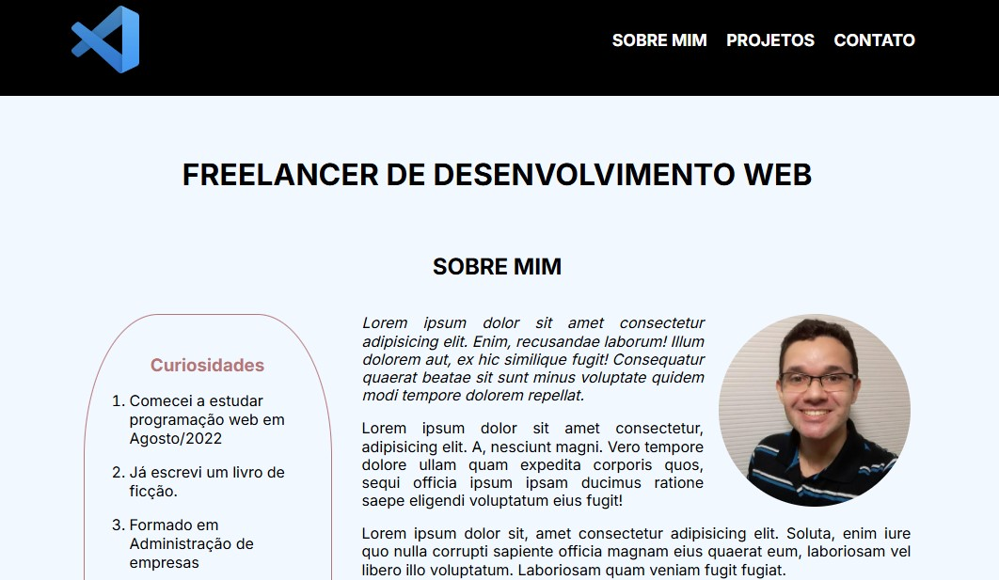

<h1 align="center"> Site One Page - Freelancer (modelo) </h1>

  <a href="#-tecnologias">Tecnologias</a>&nbsp;&nbsp;&nbsp;|&nbsp;&nbsp;&nbsp;
  <a href="#-projeto">Projeto</a>&nbsp;&nbsp;&nbsp;

 

  

## 🚀 Tecnologias

Esse projeto foi desenvolvido com as seguintes tecnologias:

- HTML e CSS
- JavaScript
- Git e Github

## 💻 Projeto

Projeto desenvolvido com o objetivo de revisar conhecimentos adquiridos, através da construção de um Site One Page, como modelo para profissional Freelancer.

[Clique aqui para acessar](https://marciorobertomr.github.io/site-modelo-freelancer/)

### Funcionamento

O site é um modelo demonstrativo de site One Page, considerando uma página para Freelancer, com a apresentação do proprietário, dos projetos e de espaço para contato.

### Melhorias

- Validação e-mail com regex através do JS antes de submeter o formulário.